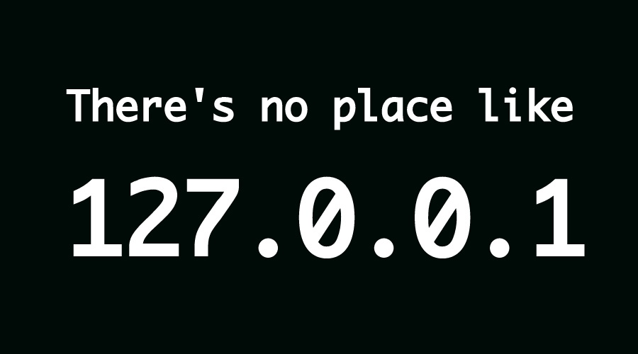

# IP Freely

The Internet Protocol defines IPv4 addresses to be 32-bits.

They are usually written in [human-readable notation](https://en.wikipedia.org/wiki/Classless_Inter-Domain_Routing), but can also be written as plain integers. For example:
The IP address 171.173.222.237 corresponds to the unsigned 32-bit
decimal integer 2880298733.

Below is a list of reserved IP address ranges. What is the sum of all
non-reserved IP addresses as a decimal integer?

## Reserved IPv4 addresses

| Range                         | Number of addresses | Scope           |
|-------------------------------|---------------------|-----------------|
| 0.0.0.0 - 0.255.255.255       | 16,777,216          | Software        |
| 10.0.0.0 - 10.255.255.255     | 16,777,216          | Private network |
| 100.64.0.0 - 100.127.255.255  | 4,194,304           | Private network |
| 127.0.0.0 - 127.255.255.255   | 16,777,216          | Host            |
| 169.254.0.0 - 169.254.255.255 | 65,536              | Subnet          |
| 172.16.0.0 - 172.31.255.255   | 1,048,576           | Private network |
| 192.0.0.0 - 192.0.0.255       | 256                 | Private network |
| 192.0.2.0 - 192.0.2.255       | 256                 | Documentation   |
| 192.88.99.0 - 192.88.99.255   | 256                 | Internet        |
| 192.168.0.0 - 192.168.255.255 | 65,536              | Private network |
| 198.18.0.0 - 198.19.255.255   | 131,072             | Private network |
| 198.51.100.0 - 198.51.100.255 | 256                 | Documentation   |
| 203.0.113.0 - 203.0.113.255   | 256                 | Documentation   |
| 224.0.0.0 - 239.255.255.255   | 268,435,456         | Internet        |
| 240.0.0.0 - 255.255.255.254   | 268,435,455         | Internet        |
| 255.255.255.255               | 1                   | Subnet          |
